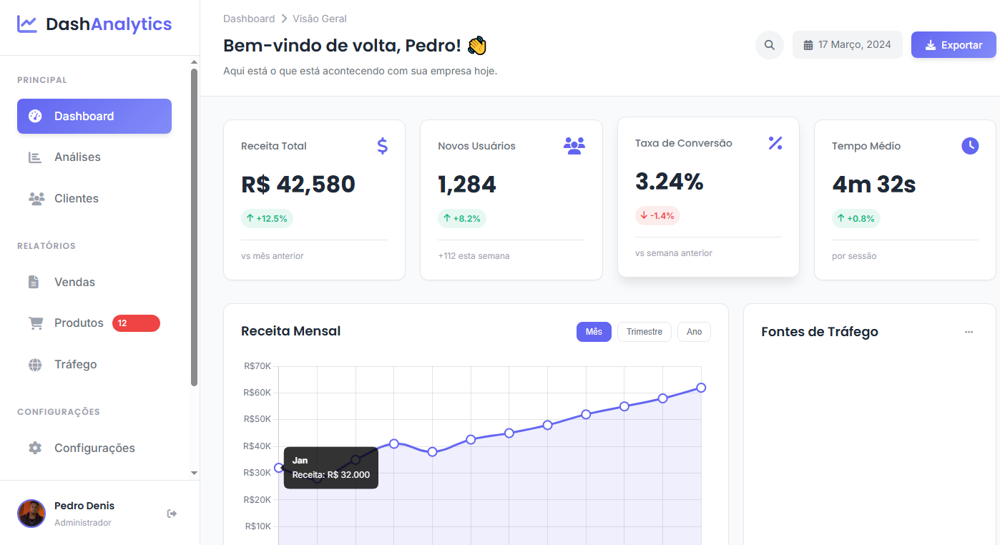

# 📊 Dashboard Analytics

Projeto de **Dashboard Analytics** desenvolvido com **HTML, CSS e JavaScript**, focado em visualização de dados, métricas de negócio e interface moderna.

---

## 🔰 Badges do Projeto


---

## 🎯 Objetivo do Projeto

Criar um dashboard responsivo para acompanhamento de métricas importantes, como:

* Receita total e mensal
* Novos usuários
* Taxa de conversão
* Tempo médio de uso
* Fontes de tráfego

Projeto ideal para estudo de **layout**, **componentização visual**, **UI/UX** e **manipulação de dados no front-end**.

---

## 📁 Estrutura do Projeto

```
dashboard-analytics/
└── dashboard2.png
└── foto-inicial.jpg  
├── index.html
├── readme.md
├── script.js
└── style.css
```

---

## 🖼 Preview do Projeto

> Interface moderna inspirada em dashboards profissionais.




---

## 🛠 Tecnologias Utilizadas
<p align="center">
  
  
  
</p>


---

## ⚙ Funcionalidades

* Cards de métricas com indicadores de crescimento
* Gráfico de receita mensal
* Navegação lateral (sidebar)
* Layout responsivo
* Interface limpa e profissional

---

## ▶️ Como Executar

1. Clone este repositório:

```bash
git clone https://github.com/Pedro07-hub/dashboard.git
```

2. Abra o arquivo **dashboard.html** no navegador.

---

## 👨‍💻 Desenvolvedor

**Pedro Denis**
Estudante de Análise e Desenvolvimento de Sistemas (ADS)

* GitHub: [https://github.com/Pedro07-hub](https://github.com/Pedro07-hub)
* LinkedIn: [https://www.linkedin.com/in/pedro-denis-947798198](https://www.linkedin.com/in/pedro-denis-947798198)

---

## 📜 Licença

Projeto desenvolvido para fins educacionais e de portfólio. Sinta-se à vontade para estudar e se inspirar, dando os devidos créditos.
